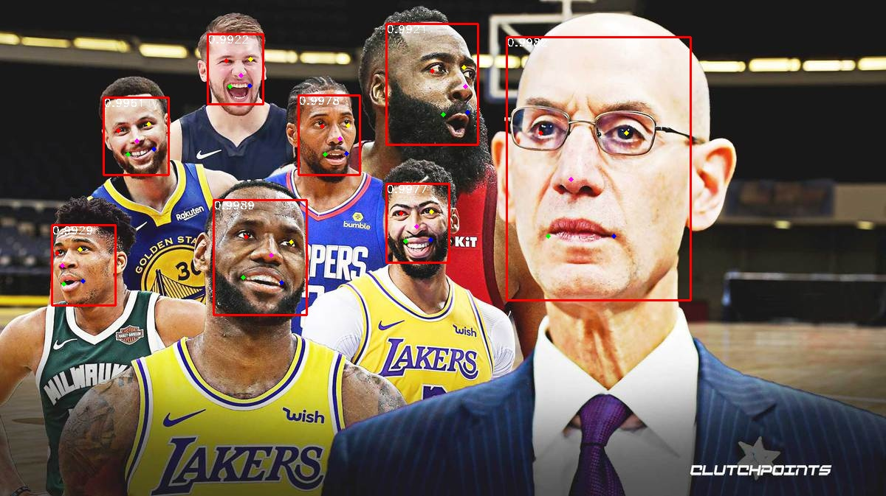

# RetinaFace-lightweight

This repository contains script for inference RetinaFace with MobileNet encoder. The remake of the https://github.com/biubug6/Pytorch_Retinaface

### Installation

```
pip install git+https://github.com/TsykunovDmitriy/retinaface_lightweight.pytorch
```
Make sure your CUDA version matches the latest PyTorch version. Otherwise, install the required version of PyTorch from [here](https://pytorch.org).
To use tensorrt, install torch2trt from [here](https://github.com/NVIDIA-AI-IOT/torch2trt)

### How to use

Inference
```python
>>> import cv2
>>> from retinaface import RetinaDetector

>>> detector = RetinaDetector(
            device="cpu", # or number of GPU (example device=0)
            score_thresh=0.5, 
            top_k=100,
            nms_thresh=0.4,
            use_trt=False,
        )

>>> image = cv2.imread(path_to_image)
>>> bboxes, landmarks, scores = detector(image)
>>> print(bboxes, landmarks, scores)
(
    [
        [xmin, ymin, xmax, ymax] 
    ],
    [
        [[x, y], # right eye
         [x, y], # left eye
         [x, y], # nose
         [x, y], # right edge of the mouth
         [x, y]] # left edge of the mouth 
    ],
    [score]
)
```

Align
```python
>>> aligned_face, trm, trm_inv = detector.aligning(image, landmarks[person])
```

Image/Video inference
```
python image_inference.py --image path_to_img.jpg --output path_to_save_result.jpg --device 0 --use_trt
python video_inference.py --video path_to_video.mp4 --output path_to_save_result.mp4 --device 0 --use_trt
```

### Example

<p align="center"></p>
